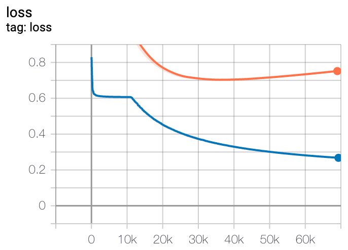
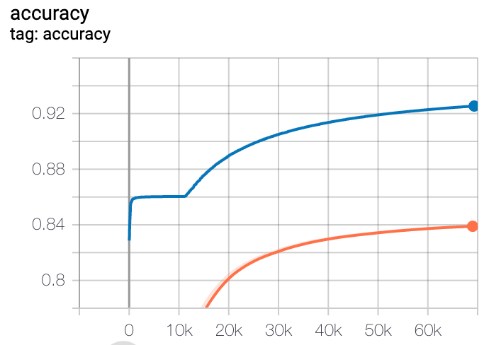
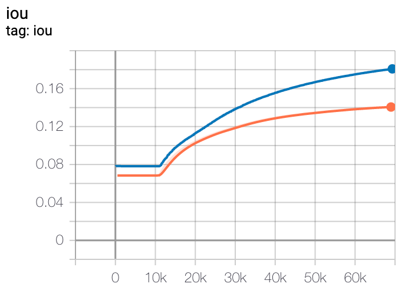
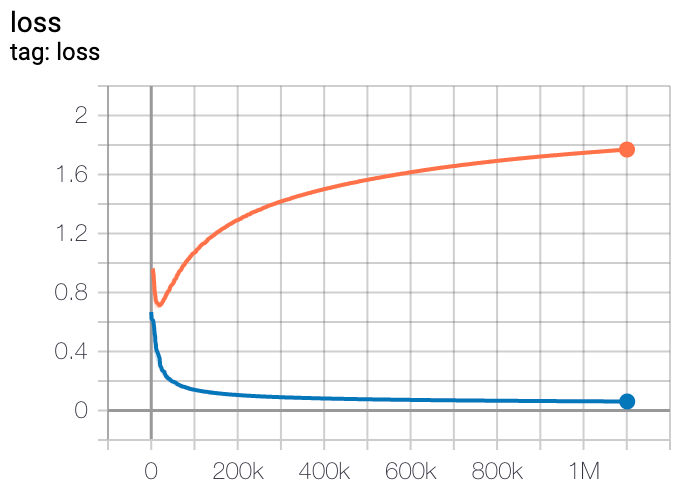
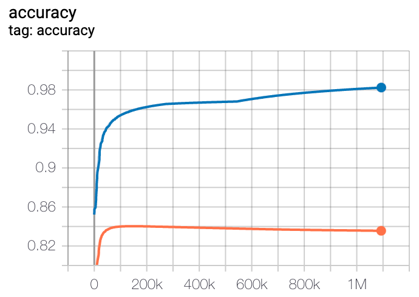
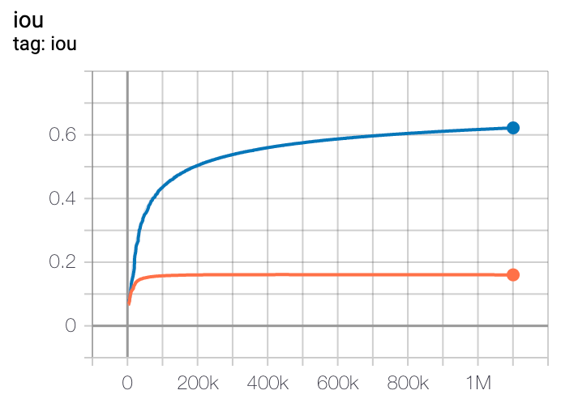
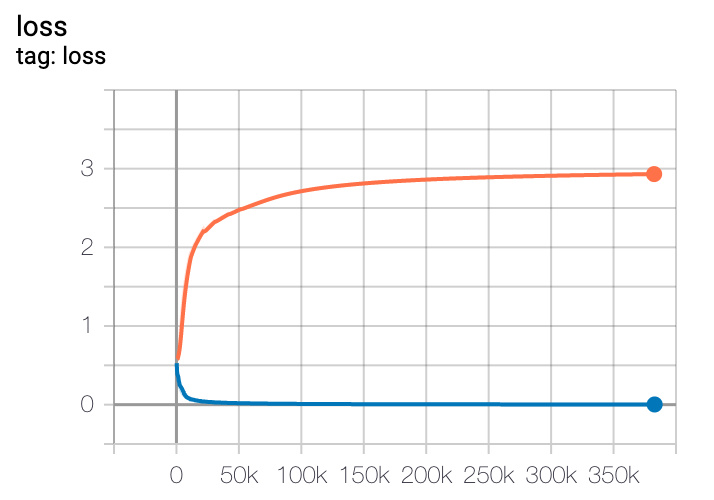
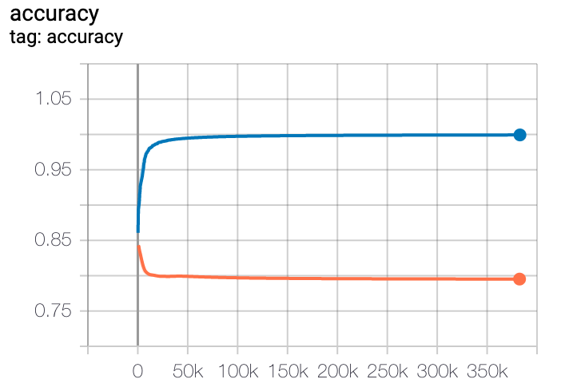
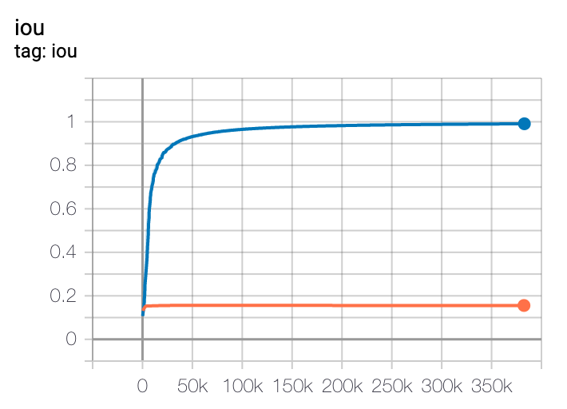

# v1_3: Add random flip data augmentation

- Add random left to right flip to all images

# v1_2: Add random remap colors data augmentation

- Add random remap colors to all images
- Test lost improves until around 35k. Then it starts to memorize again. An improvement.

| Loss | Accuracy | IoU |
|---------|-------------|-------|
|  |  |  |

# v1_1: Add random roll data augmentation

- Add random roll to all images
- Bump padding size from 30 to 32
- Update model to support new 32x32 size
- Test loss reduced, training appears harder / less memorization, hard to tell with other metrics since they count over the whole 32x32 grid, I think it is an improvement.

| Loss | Accuracy | IoU |
|---------|-------------|-------|
|  |  |  |

# v1_0: Baseline

- Use fully convolutional network with LSTM in middle
- Overfits training set and loss of validation increases

| Loss | Accuracy | IoU |
|---------|-------------|-------|
|  |  |  |
