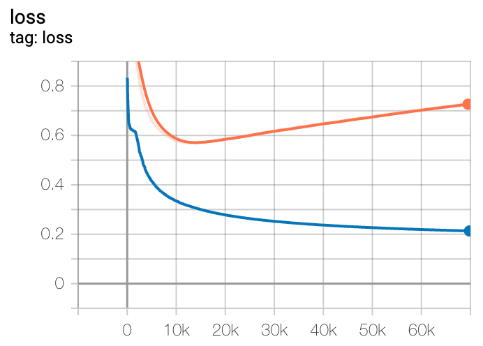
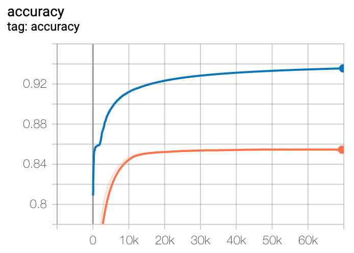
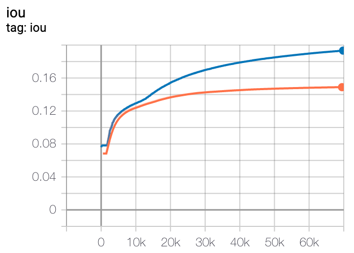

# v1_16: Skip test input to final output layer to encourage copying

- Skip test input to final output layer to encourage copying
- Remove double layers for now
- Greatly improves test and train metrics

# v1_15: Double layers with gated skip connections

- Double layers with LSTM like gated skip connections

# v1_14: Double layers

- conv_channels = [3, 6, 12, 24, 48]
- trains too slow

# v1_13: Medium size model

- conv_channels = [6, 12, 24, 48, 96]
- test keeps improving but progress is very slow and not quite as good v1_8

# v1_12: Tiny size model

- conv_channels = [1, 2, 4, 8, 16]

# v1_11: Medium size model with new learning rate

- Basically the same as last medium model

# v1_10: Try a slightly larger learning rate

- Switched from 1e-3 to 5e-3.
- Improvement in learning speed and best test scores but training loss does not get as low

# v1_9: Try a larger learning rate

- Swiched from 1e-3 to 1e-1.
- Model failed to learn anything

# v1_8: Try an even smaller model

- conv_channels = [6, 12, 24, 48, 96] -> [3, 6, 12, 24, 48]
- Improvment in test convergence compared to v1_4/v1_5

# v1_7: Try a larger learning rate

- Swiched from 1e-3 to 1e-2.
- Doesn't seem like an improvement (reverted)

# v1_6: Try a smaller model

- conv_channels = [24, 48, 96, 192, 384] -> [6, 12, 24, 48, 96]
- Improved test and training loss and other metrics

# v1_5: Switch to Adam-W optimizer and TF2.2

- Switch to Adam-W optimizer and TF2.2
- Not significant enough improvement

# v1_4: Add random rotation data augmentation

- Add random rotation to all images
- Improved across all metrics but peaks at around 70k

# v1_3: Add random flip data augmentation

- Add random left to right flip to all images
- Improved across all metrics but peaks at around 14k. 

| Loss | Accuracy | IoU |
|---------|-------------|-------|
|  |  |  |

# v1_2: Add random remap colors data augmentation

- Add random remap colors to all images
- Test lost improves until around 35k. Then it starts to memorize again. An improvement.

| Loss | Accuracy | IoU |
|---------|-------------|-------|
|  |  |  |

# v1_1: Add random roll data augmentation

- Add random roll to all images
- Bump padding size from 30 to 32
- Update model to support new 32x32 size
- Test loss reduced, training appears harder / less memorization, hard to tell with other metrics since they count over the whole 32x32 grid, I think it is an improvement.

| Loss | Accuracy | IoU |
|---------|-------------|-------|
|  |  |  |

# v1_0: Baseline

- Use fully convolutional network with LSTM in middle
- Overfits training set and loss of validation increases

| Loss | Accuracy | IoU |
|---------|-------------|-------|
|  |  |  |
