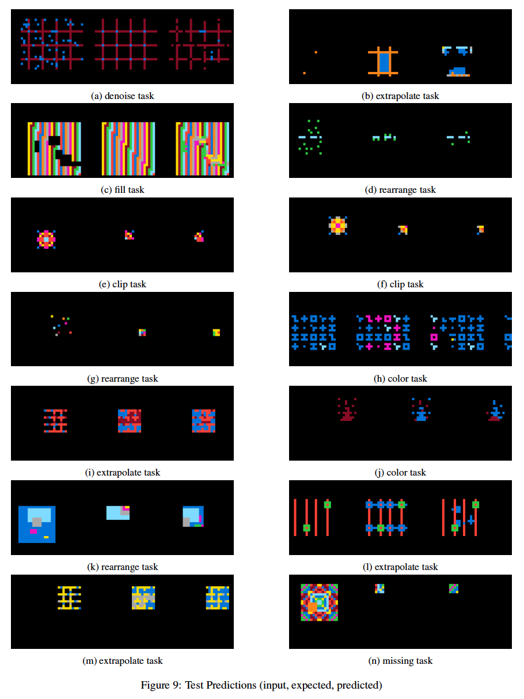

# Deep Modules For Abstract Reasoning Corpus
Contact: Logan Bruns <logan@gedanken.org>

### Abstract from project paper
The Abstraction and Reasoning Corpus (ARC) attempts to provide a
benchmark on abstract reasoning given a limited number of visual
priors. We train a deep learning model to run against this benchmark
and show that it is capable of recognizing certain types of tasks
from a few examples and then perform these tasks at least to some
extent. The best test accuracy was .94 and then IoU was .56 but the
qualitative analysis of the predictions is perhaps more
interesting. Observations are made about which portions of the data
preprocessing and architecture are important and why.

### Example predictions on test dataset



### Repository layout

#### Source files

_Makefile_: top level makefile to run training, start tensorboard and start notebook server

_deeparc.py_: training script

_arc\_model.py_: model class containing model architecture and losses

_layer\_utils.py_: utilities for creating model layers

_data\_transforms.py_: dataset transforms for creating features and augmenting data

_arc.py_: ARC dataset loader

_json\_to\_tfrecord.py_: script to convert dataset to tfrecord format

_environment.yml_: conda environment yaml for creating python virtual environment

_Experiments.md_: brief experiments logs

#### Directories

_data/_ directory to download dataset to and store transformed forms

_experiments/_ directory to hold experiment checkpoints and tensorboard logs

### Environment preparation steps

```
$ conda env create --name deep-module-arc --file environment.yml
$ conda activate deep-module-arc
```

### Data preparation steps

#### Download dataset from kaggle
Download ARC kaggle dataset zip from kaggle:

https://www.kaggle.com/c/abstraction-and-reasoning-challenge/data

#### Unzip into input directory

```
$ cd data
$ unzip /path/to/abstraction-and-reasoning-challenge.zip 
```

#### Convert from JSON to TFRECORD

```
$ python json_to_tfrecord.py
```

### Training steps

#### Start tensorboard

```
$ make tensorboard
```

#### Start training

```
$ make train
```

#### Monitor training and results in tensorboard

Go to http://localhost:6006/ or http://hostname:6006/ and click images
tab to see examples of the training context images, predictions, and
ground truth.
